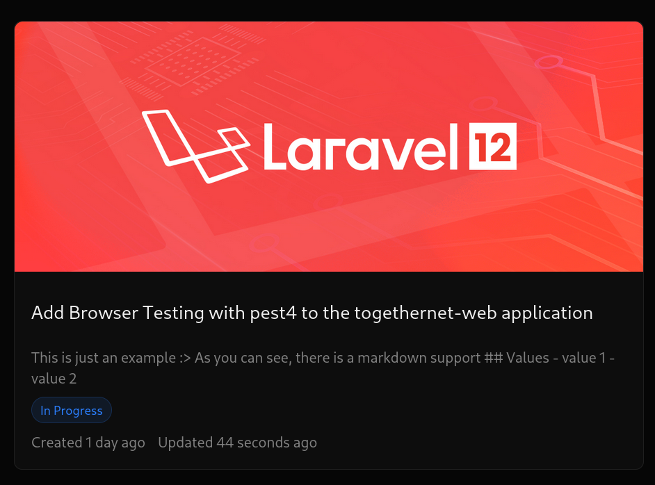

## Docker Deployment (Production)

This project is configured for production deployment using **FrankenPHP**.

### Setup & Run
1.  **Generate a Production Key**:
    ```bash
    php artisan key:generate --show
    ```

2.  **Environment Variables**:
    Set `APP_KEY` and `DB_PASSWORD` in your `docker-compose.prod.yml` file under the `environment` section, or use Docker secrets for sensitive values.

3.  **Run with Docker Compose**:
    ```bash
    docker compose -f docker-compose.prod.yml up -d --build
    ```

4.  **Run Migrations (First Time)**:
    ```bash
    docker compose -f docker-compose.prod.yml exec app php artisan migrate --force
    ```

### Cloudflare Tunnel
The application is exposed on port **8080**. You can point your Cloudflare Tunnel to:
`http://localhost:8080`
